

  <h1>🔗 Free Dynamic QR</h1>
  
<strong>Un acortador de URLs y generador de códigos QR dinámicos 100% gratuito.</strong>

  

    
    
    
  

---

## ✨ ¿Qué es?

Este proyecto te permite alojar tu propio sistema de **Códigos QR Dinámicos** y **Acortador de Enlaces** en tu propia cuenta de Cloudflare (usando Cloudflare Workers y KV). 

- 💸 **100% Gratis:** Sin suscripciones, sin cuotas mensuales y sin límites artificiales.
- 🔄 **Dinámico:** Cambia la URL de destino de tus códigos QR en cualquier momento sin tener que volver a imprimirlos.
- 🚀 **Rápido y Global:** Funciona en la red edge de Cloudflare.
- 🎨 **Panel Elegante:** Incluye una interfaz web bonita y fácil de usar para gestionar tus enlaces.

---

## 📖 Guía de Instalación Paso a Paso

Sigue esta guía visual para configurar tu propio generador en menos de 5 minutos. **No se requieren conocimientos técnicos.**

### Paso 1: Crear cuenta en Cloudflare
Entra en Cloudflare y regístrate con una cuenta nueva en: [dash.cloudflare.com/login](https://dash.cloudflare.com/login)

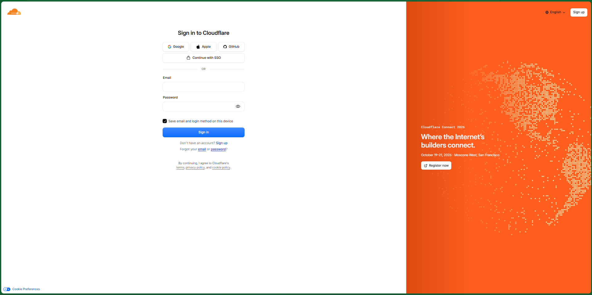

### Paso 2: Crear la Base de Datos (KV)
Una vez logueado, dirígete al apartado **Workers & Pages > KV** (dentro de *Storage and databases*) y haz clic en **Create a namespace**.

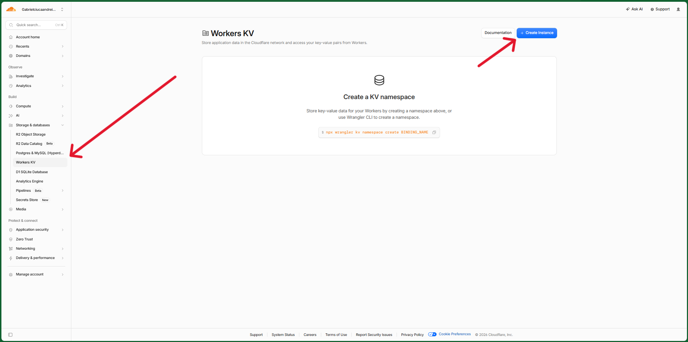

Una vez creado, en el apartado de métricas podrás ver el nombre que le hemos puesto y el ID asignado. Tenlo en cuenta para un paso futuro.

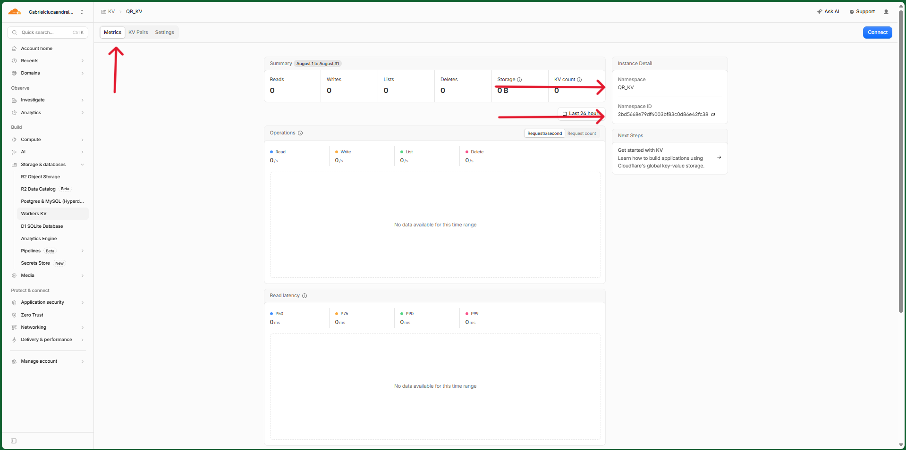

### Paso 3: Crear la Aplicación (Worker)
Ahora entra a **Workers & Pages** (en el apartado de *Compute*) y pulsa en **Create application** y luego **Create Worker**.

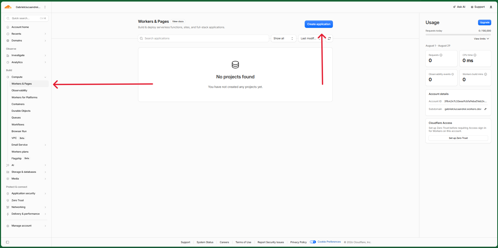

La aplicación debe ser del tipo **Hello World** como marca la flecha.

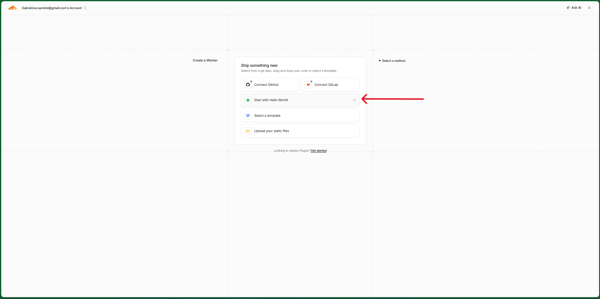

### Paso 4: Añadir el Código
Una vez creado, en el apartado Overview pulsa el botón **Edit code** que indica la flecha.

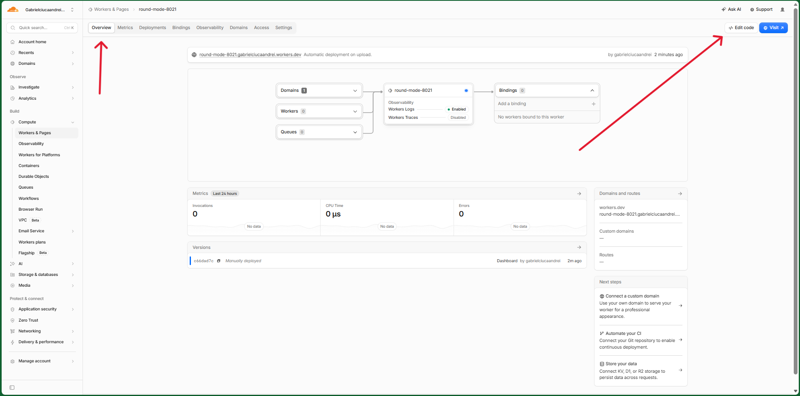

Entra en este repositorio, copia **todo el contenido** del archivo `worker.js` y pégalo donde antes estaba el código de *Hello World*. Por último, pulsa el botón de **Deploy** arriba a la derecha.

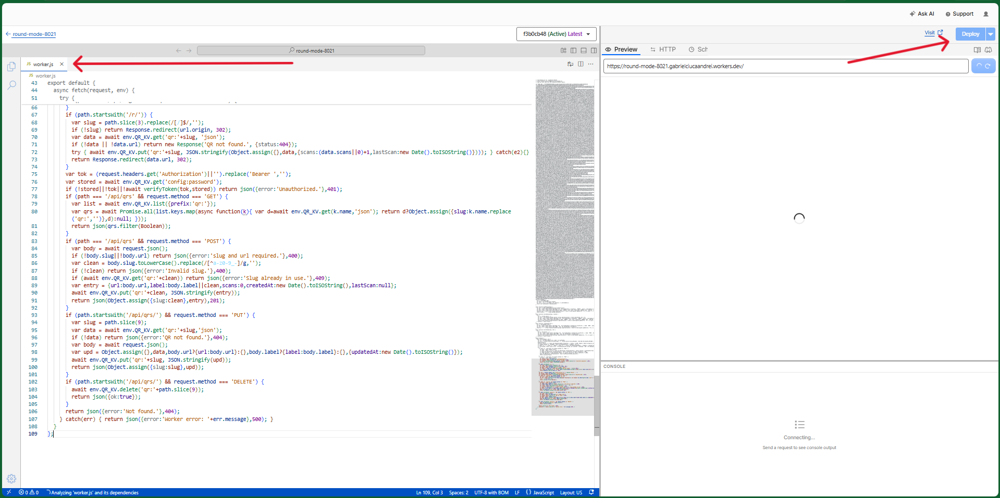

### Paso 5: Conectar la Base de Datos al Código
Sal del editor de código, ve a la pestaña **Settings > Bindings** y añade un nuevo binding del tipo **KV namespace**.

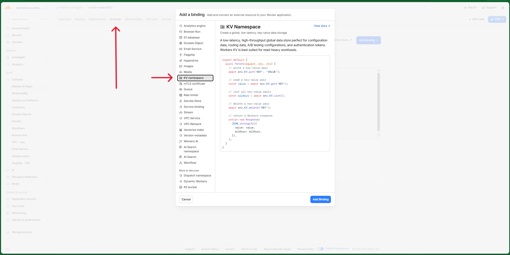

Para crear el binding, te pedirá un nombre de variable: **tienes que poner obligatoriamente `QR_KV`**. En el desplegable, selecciona el namespace que creaste en el Paso 2. Pulsa en Deploy/Guardar.

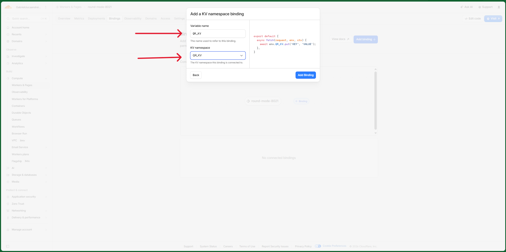

### Paso 6: Configurar tu Contraseña
Vuelve a la pestaña *Overview* y pulsa el enlace debajo de *Preview* o el botón **Visit** para abrir tu aplicación. 

Al entrar por primera vez te pedirá crear una contraseña. Esta será la contraseña de administrador para entrar al panel de control en el futuro.

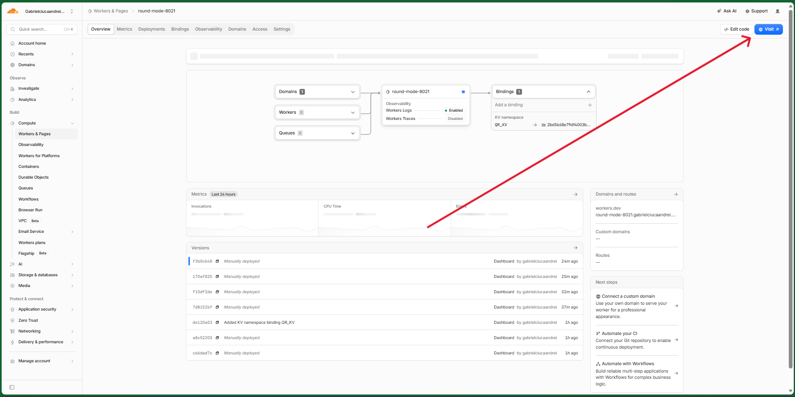

### Paso 7: Crear y Gestionar tus QR
¡Listo! Para añadir un código QR necesitas un **Slug** (el texto final de la URL corta), la **URL de destino** y un **Nombre** (opcional). 

Los códigos QR aparecerán en la lista inferior. Podrás editar la URL de destino en el futuro si lo necesitas, **¡sin que el código QR cambie ni se rompa!**

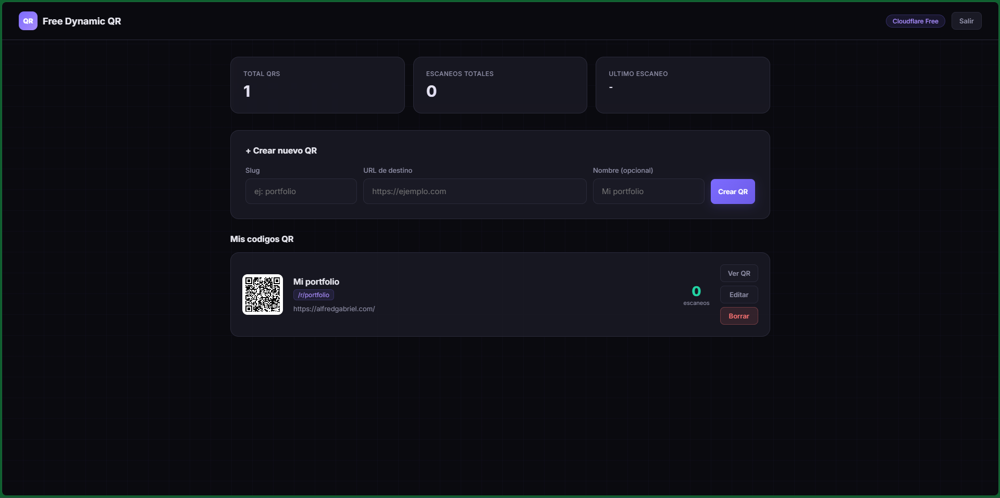

---
*Hecho con ❤️ para la comunidad.*
